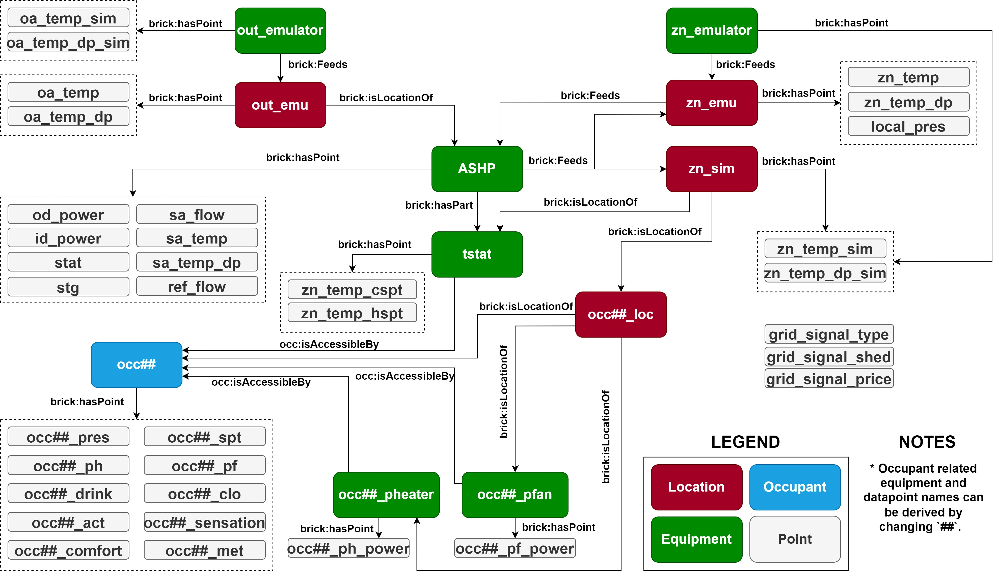

# HILFT-ASHP-README

## Table of Contents
- [Introduction](#introduction)
- [Methodology](#methodology)
- [Software Testbed](#software-testbed)
- [Hardware Testbed](#hardware-testbed)
- [Test Scenarios](#test-scenarios)
- [Data Description](#data-description)

## Introduction
This document provides comprehensive details of the datasets generated from the project titled, "Hardware-in-the-Loop Laboratory Performance Verification of Flexible Building Equipment in a Typical Commercial Building." This project is financially supported by the U.S. Department of Energy under grant number EE-0009153. These datasets are obtained from extensive hardware-in-the-loop (HIL) testing of an Air Source Heat Pump (ASHP) system at the National Institute of Standards and Technology (NIST), conducted under a diverse range of conditions and operational settings. Specifically, the methodology, building and system information, data points specifications, and test settings of different scenarios are included in this document.

## Methodology
The datasets in this repository were generated using an Air Source Heat Pump Hardware-In-the-Loop Flexible load Testbed (i.e., ASHP HILFT). The figure below depicts the overall framework of a HILFT, which mainly includes three parts: a virtual building model, a Grid-interactive Efficient Building (GEB) control model, and a hardware testbed. The virtual building model further includes a zone load model, an occupant comfort & behavior model, and an airflow model. More details about the development and integration of the HILFT can be found in [^1].

## Software Testbed
### Building (Zone Load) Model
The building (zone load) model was adapted from [Commercial Prototype Building Models](https://www.energycodes.gov/prototype-building-models). The highlighted zone, **Perimeter_ZN_1**, was selected for HIL study while other zones were served by ideal load systems within EnergyPlus. 

## Hardware Testbed
### System Configuration
The hardware testbed utilizes the NIST ASHP testing facility, which is equipped with two environmental chambers that emulate indoor and outdoor air conditions. Water-cooled, electrically heated AHUs are included in both chambers to create the outdoor weather conditions and the zone load. The system is a two-stage air source heat pump. Figure below depicts the system configureation.

### System Control Sequence
The heat pump system is controlled based on the zone return air temperature. When return air temperature is 0.28 °C (0.5 °F) higher than the cooling setpoint, the heat pump operates in low-speed mode until the temperature drops below the cooling setpoint. When return air temperature exceeds 0.56 °C (1 °F) above the cooling setpoint, the heat pump operates in high-speed mode until the temperature drops below 0.28 °C (0.5 °F) above the cooling setpoint and then switches back to low-speed mode.

## Test Scenarios
The test matrix for ASHP testing is outlined in the table below. The first column indicates the climate location. The four locations are: Atlanta, Buffalo, New York, and Tucson. The second column specifies the Grid-interactive Efficient Building (GEB) control scenario. The three GEB scenarios are: Efficiency (Eff), Load Shedding (Shed), and Load Shifting (Shift). The subsequent columns delineate additional testing settings. These settings consider various factors such as weather, control strategy, building type, occupancy, occupant behavior, and thermal energy storage (TES).

| Location | GEB Scenario | Default | ExtrmSum | TypShldr | ExtrmWin | MPC | STD2019 | DenOcc | EnergySave | TES | MPC&TES |
| ---      | ---          | ---     | ---      | ---      | ---      | --- | ---     | ---    | ---        | --- | ---     |
| Atlanta  | Eff          | x       | x        | x        | x        | x   | x       | x      | x          |     |         |
|          | Shed         | x       | x        |          |          | x   | x       | x      | x          |     |         |
|          | Shift        | x       | x        |          |          | x   | x       | x      | x          | x   | x       |
| Buffalo  | Eff          | x       | x        | x        | x        | x   | x       | x      | x          |     |         |
|          | Shed         | x       | x        |          | x        | x   | x       | x      | x          |     |         |
|          | Shift        | x       | x        |          | x        | x   | x       | x      | x          | x   | x       |
| New York | Eff          | x       | x        | x        | x        | x   | x       | x      | x          |     |         |
|          | Shed         | x       | x        | x        | x        | x   | x       | x      | x          |     |         |
|          | Shift        | x       | x        | x        | x        | x   | x       | x      | x          | x   | x       |
| Tucson   | Eff          | x       | x        | x        | x        | x   | x       | x      | x          |     |         |
|          | Shed         | x       | x        | x        | x        | x   | x       | x      | x          |     |         |
|          | Shift        | x       | x        | x        | x        | x   | x       | x      | x          | x   | x       |

## Data Description
### File Structure
All datasets are stored in the [data](data) folder. This folder contains three levels. The first level is associated with the first column of the test scenarios table, the second level is associated with the second column of the test scenarios table, and the thrid level is associated with the remaining columns of the test scenarios table.

For each scenario, there are two files: 
- `data.csv` file is the official release of the data associated with each scenario. The definition of each data point (each column) is documented in the [metadata](metadata.csv) file.
- `raw.mat` file is the raw data which may include additional data associated with the HIL simulation, such as emulation data, controller parameters, and other simulation data.

### Data Schema
`ashp_brick.ttl` is the Brick model that represents the data points and their relationships. The following shows the data point relations created under the Brick model.

## Contact Information

For any additional questions, clarifications, or feedback, you can reach out to:

- **Jin Wen, PhD**: 
  - **Email**: jw325@drexel.edu

- **Zhelun Chen, PhD**: 
  - **Email**: zl.chen.career@gmail.com

[^1]: Chen, Zhelun, et al. "Development of a Hardware-in-theloop Testbed for Laboratory Performance Verification of Flexible Building Equipment in Typical Commercial Buildings." arXiv preprint arXiv:2301.13412 (2023). [[Paper](https://arxiv.org/abs/2301.13412)]

