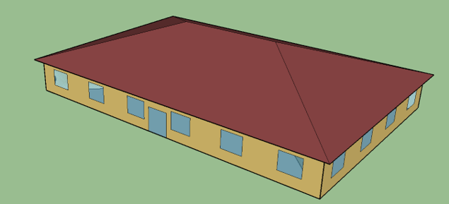
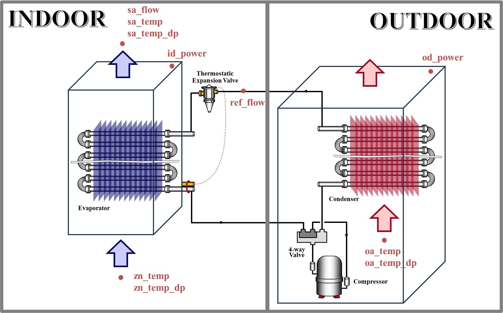

# HILFT-ASHP-README

## Table of Contents
- [Introduction](#introduction)
- [Methodology](#methodology)
- [Building and System Information](#building-and-system-information)

## Introduction
This document provides comprehensive details of the datasets generated from the project titled, "Hardware-in-the-Loop Laboratory Performance Verification of Flexible Building Equipment in a Typical Commercial Building." This project is financially supported by the U.S. Department of Energy under grant number EE-0009153. These datasets are obtained from extensive hardware-in-the-loop (HIL) testing of an Air Source Heat Pump (ASHP) system at the National Institute of Standards and Technology (NIST), conducted under a diverse range of conditions and operational settings. Specifically, the methodology, building and system information, data points specifications, and test settings of different scenarios are included in this document.

## Methodology
The datasets in this repository were generated using an Air Source Heat Pump Hardware-In-the-Loop Flexible load Testbed (i.e., ASHP HILFT). The figure below depicts the overall framework of a HILFT, which mainly includes three parts: a virtual building model, a Grid-interactive Efficient Building (GEB) control model, and a hardware testbed. The virtual building model further includes a zone load model, an occupant comfort & behavior model, and an airflow model. More details about the development and integration of the HILFT can be found in XXX.

## Building and System Information
### Building Model
The building (zone load) model was adapted from [Commercial Prototype Building Models](https://www.energycodes.gov/prototype-building-models). The highlighted zone, `Perimeter_ZN_1`, was selected for HIL study while other zones were served by ideal load systems within EnergyPlus. 

### System Configuration
The hardware testbed utilizes the NIST ASHP testing facility, which is equipped with two environmental chambers that emulate indoor and outdoor air conditions. Water-cooled, electrically heated AHUs are included in both chambers to create the outdoor weather conditions and the zone load. The system is a two-stage air source heat pump. Figure below depicts the system configureation.

